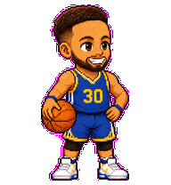
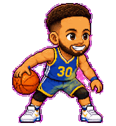
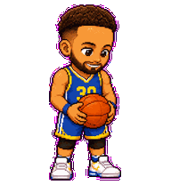
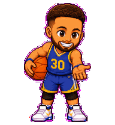
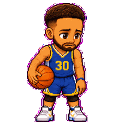
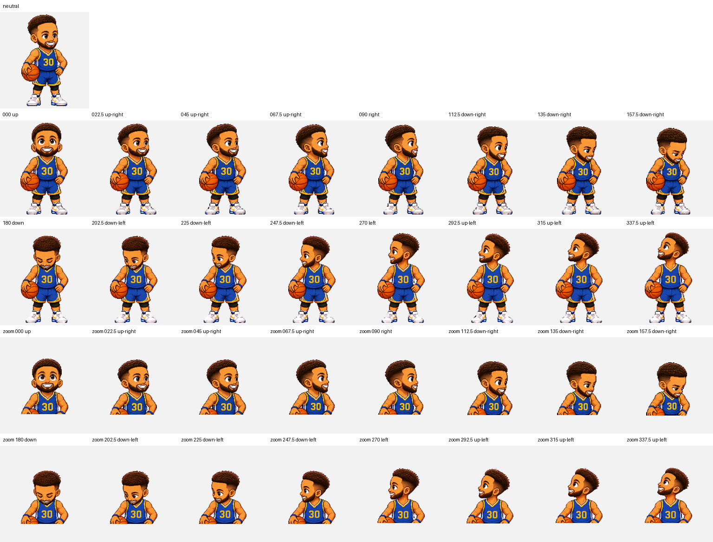

# Chef 30 — a Stephen Curry-inspired Codex pet

<p align="center">
  
</p>

<p align="center">
  An original, fan-made pixel companion for the Codex desktop app.<br>
  Nine task-aware animations, 16-direction gaze tracking, and a flicker-free hover pose.
</p>

<p align="center">
  <a href="README.zh-CN.md">简体中文</a> ·
  <a href="https://github.com/FrankJing420/chef-30-codex-pet/releases/latest">Latest release</a> ·
  <a href="https://learn.chatgpt.com/docs/pets">Codex Pets documentation</a>
</p>

## Download

Download the ready-to-install package from the [latest GitHub release](https://github.com/FrankJing420/chef-30-codex-pet/releases/latest), or use the direct [Chef 30 v2.1 ZIP](https://github.com/FrankJing420/chef-30-codex-pet/releases/latest/download/Chef-30-Codex-Pet-v2.1.zip).

## What Chef 30 does

| Codex interaction | Animation |
| --- | --- |
| Idle | Calm breathing, blinking, and ball control |
| Working | Focused crossover dribble |
| Needs input | Holds the ball and waits for you |
| Blocked | Missed-shot reaction, then regains composure |
| Ready | Reviews the result and celebrates |
| First wake | Waves into the task |
| Pointer hover | Enters a stable shooting-pocket pose and stays still |
| Drag left / right | Two independently drawn fast-break runs |
| Pointer tracking | Looks in 16 clockwise directions |

## Install

### macOS one-click install

1. Download and unzip the release.
2. Double-click `install.command`.
3. In Codex, open **Settings → Pets**, click **Refresh**, and select **Chef 30**.
4. Enter `/pet` in a task to wake him up.

### Manual install

From the repository root:

```bash
mkdir -p "$HOME/.codex/pets/chef-30"
cp pet.json spritesheet.webp "$HOME/.codex/pets/chef-30/"
```

Then refresh the Pets settings and select Chef 30. If an older version is already awake, enter `/pet` once to tuck it away and once more to reload it.

## Why v2.1 does not flicker on hover

The native hover state loops a five-cell animation row. A large jump-shot sequence can therefore feel like rapid action switching while the pointer remains over the pet. Chef 30 v2.1 uses one pixel-identical calm pose across all five hover cells: it changes pose once on entry, then remains completely still.

Pixel regression testing confirms that only the hover row changed from v2; the other ten atlas rows are byte-for-byte identical at the decoded-pixel level.

## Animation preview

| Idle | Working | Ready |
| --- | --- | --- |
|  |  |  |

| Needs input | Blocked | Drag right |
| --- | --- | --- |
|  |  |  |

The v2 atlas also includes 16 gaze directions:



## Package format

- Codex Pet sprite contract: v2
- Atlas: transparent WebP, `1536 × 2288`
- Grid: `8 × 11`, with `192 × 208` cells
- Core states: 9 animation rows
- Pointer look: 16 directions in 22.5° increments
- Manifest ID: `chef-30`

The repository root is itself an installable pet package. Generation prompts are kept in [`generation-prompts/`](generation-prompts/), while machine-readable validation and visual review results are in [`qa/`](qa/).

## Quality checks

- Official v2 atlas validation: pass, 0 errors, 0 warnings
- Transparent RGB residue: 0 pixels
- Hover frames: 5 pixel-identical cells
- Direction semantics: three blind-review rounds passed
- Final independent visual review: passed

See [QA.md](QA.md) for the human-readable summary.

## Disclaimer

Chef 30 is an unofficial fan project inspired by Stephen Curry. It is not affiliated with, endorsed by, or sponsored by Stephen Curry, SC30, the NBA, the Golden State Warriors, Under Armour, OpenAI, or their affiliates. No team logos, official photos, official audio, or branded uniform marks are included. Names, trademarks, and publicity rights remain with their respective owners. See [NOTICE.md](NOTICE.md).

## License

Code and documentation are available under the [MIT License](LICENSE-CODE). Original visual assets are available for non-commercial sharing and adaptation under [CC BY-NC 4.0](LICENSE-ASSETS). Third-party names, trademarks, and publicity rights are not licensed.
