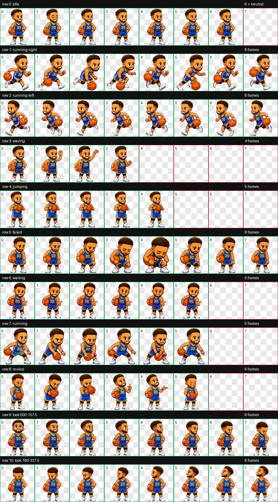

# Chef 30：Stephen Curry 灵感 Codex 桌宠

<p align="center">
  
</p>

<p align="center">
  原创、非官方的蓝金 30 号像素桌宠。<br>
  包含 9 组任务状态动作、16 方位视线追踪，以及不会闪动的稳定悬停姿势。
</p>

<p align="center">
  <a href="README.md">English</a> ·
  <a href="https://github.com/FrankJing420/chef-30-codex-pet/releases/latest">下载最新版</a> ·
  <a href="https://learn.chatgpt.com/docs/pets">Codex Pets 官方文档</a>
</p>

## 下载

从 [GitHub Releases](https://github.com/FrankJing420/chef-30-codex-pet/releases/latest) 下载可直接安装的压缩包，或使用 [Chef 30 v2.1 直链](https://github.com/FrankJing420/chef-30-codex-pet/releases/latest/download/Chef-30-Codex-Pet-v2.1.zip)。

## 互动动作

| Codex 交互 | Chef 30 动作 |
| --- | --- |
| 待机 | 呼吸、眨眼和轻微控球 |
| 工作中 | 专注交叉运球 |
| 需要输入 | 抱球等待你操作 |
| 任务受阻 | 投失后调整情绪、重新振作 |
| 任务就绪 | 检查结果并庆祝 |
| 首次唤醒 | 挥手入场 |
| 鼠标悬停 | 进入稳定投篮准备姿势并保持静止 |
| 左右拖动 | 两套独立绘制的快攻跑动 |
| 鼠标追踪 | 16 个顺时针视线方向 |

## 安装

### macOS 双击安装

1. 下载并解压 Release 包。
2. 双击 `install.command`。
3. 在 Codex 中打开 **Settings → Pets**，点击 **Refresh**，选择 **Chef 30**。
4. 在任务输入框输入 `/pet` 唤醒。

### 手动安装

在仓库根目录运行：

```bash
mkdir -p "$HOME/.codex/pets/chef-30"
cp pet.json spritesheet.webp "$HOME/.codex/pets/chef-30/"
```

随后刷新 Pets 设置并选择 Chef 30。如果旧版正在显示，输入一次 `/pet` 收起，再输入一次重新加载。

## v2.1 悬停修复

Codex 原生悬停状态会循环播放五个单元格。大幅度跳投动作会因此显得像鼠标停留时不停快速切换。v2.1 将五个悬停单元格固定为像素完全一致的持球姿势：进入悬停时只切换一次，之后保持静止。

像素回归检查确认，从 v2 到 v2.1 只有悬停行发生变化，其余十行全部保持不变。

## 规格与验收

- Codex Pet v2 图集：透明 WebP，`1536 × 2288`
- 网格：`8 × 11`，单格 `192 × 208`
- 9 组核心状态，16 个视线方向
- 官方 v2 校验：0 错误、0 警告
- 透明像素 RGB 残留：0
- 独立视觉验收：通过

完整生成提示位于 [`generation-prompts/`](generation-prompts/)，机器可读报告位于 [`qa/`](qa/)，人工验收摘要见 [QA.md](QA.md)。

## 声明

Chef 30 是受 Stephen Curry 启发的非官方粉丝项目，与 Stephen Curry、SC30、NBA、Golden State Warriors、Under Armour、OpenAI 或其关联方无隶属、授权、赞助或背书关系。项目未使用球队 Logo、官方照片、真人音频或品牌球衣标识；姓名、商标及人格权归各自权利人所有。详见 [NOTICE.md](NOTICE.md)。

## 许可

代码与文档采用 [MIT License](LICENSE-CODE)；原创视觉资产采用 [CC BY-NC 4.0](LICENSE-ASSETS)，允许署名、非商业分享与改编。第三方姓名、商标及人格权不在许可范围内。
